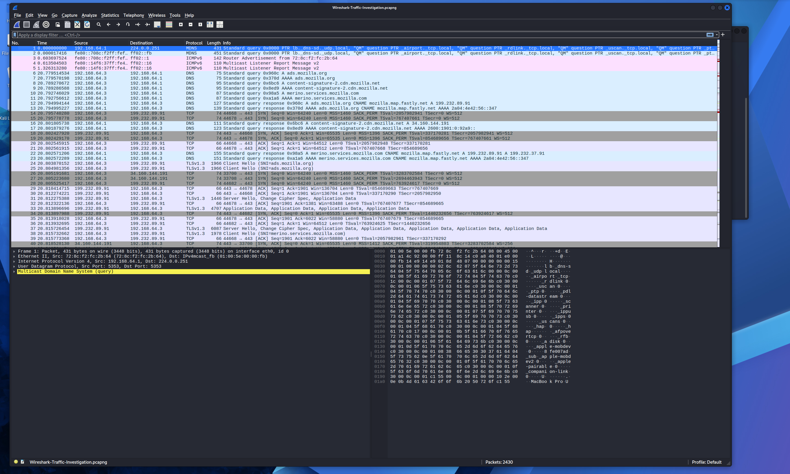
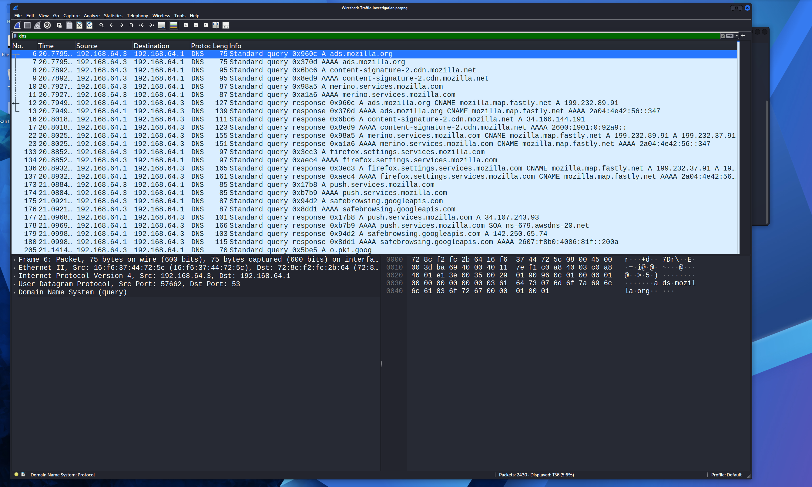
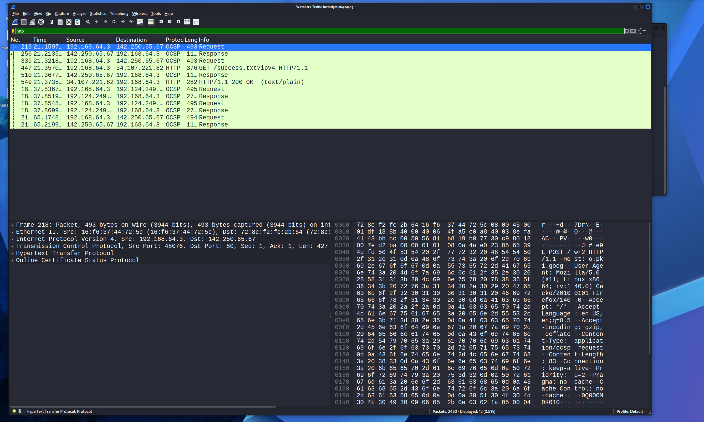
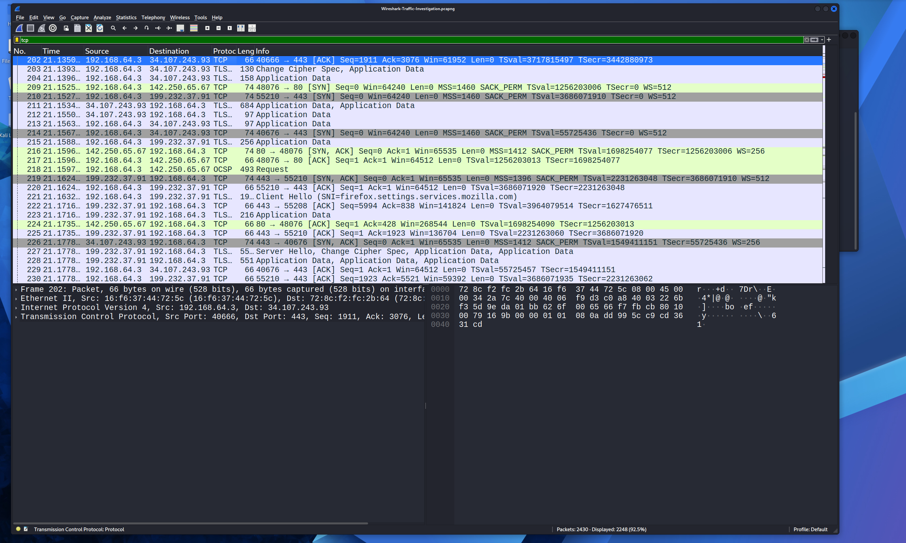
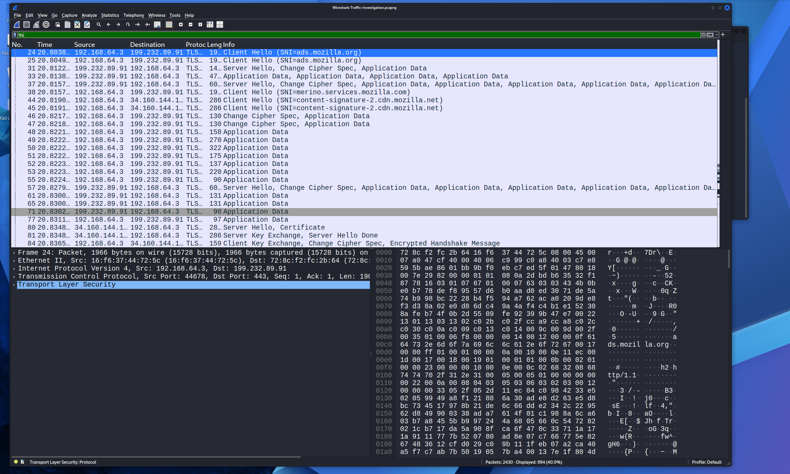
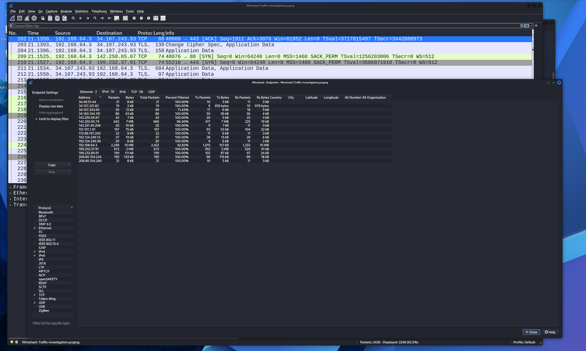
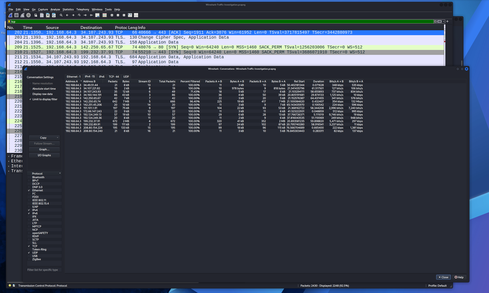

# Wireshark Lab 1 – Traffic Investigation

## Objective

Analyze captured network traffic using Wireshark to identify network protocols, DNS activity, web traffic, encryption mechanisms, and browser-generated communications. The goal was to practice packet analysis techniques commonly used by SOC analysts and incident responders.

---

## Tools Used

- Kali Linux
- Wireshark
- PCAP File Analysis
- DNS Filtering
- TCP Stream Analysis
- TLS Inspection

---

## Investigation Process

1. Opened the provided PCAP file in Wireshark.
2. Reviewed overall network activity and packet statistics.
3. Filtered traffic by protocol:
   - DNS
   - HTTP
   - TCP
   - TLS
4. Examined conversations and endpoints to identify active hosts.
5. Investigated encrypted traffic using TLS handshake information.
6. Reviewed HTTP requests to identify hostnames and browser activity.
7. Documented findings and determined whether any suspicious activity was present.

---

## Overview

The packet capture contained approximately 2,400 packets consisting primarily of DNS queries, HTTP traffic, TLS-encrypted sessions, multicast traffic, and browser-generated communications from Mozilla Firefox.

### Screenshot

---

## DNS Analysis

### Findings

- Multiple DNS queries were observed.
- Queries primarily resolved Mozilla and Google-related domains.
- DNS activity was used to translate hostnames into IP addresses before establishing network connections.

### Example Domains

- ads.mozilla.org
- push.services.mozilla.com
- safebrowsing.googleapis.com

### Screenshot

---

## HTTP Analysis

### Findings

- Destination Port: 80
- Protocol: HTTP
- Encryption: None

### Host Header

detectportal.firefox.com

### User-Agent

Mozilla/5.0 (X11; Linux x86_64; rv:140.0) Gecko/20100101 Firefox/140.0

### Why Host and User-Agent Were Visible

HTTP traffic is transmitted in plaintext, allowing request headers to be viewed directly. HTTPS traffic encrypts application-layer data, preventing direct inspection without decryption.

### Screenshot

---

## TCP Analysis

### Findings

- TCP three-way handshakes were observed.
- Connections were established successfully with external hosts.
- No excessive retransmissions or connection failures were identified.

### Screenshot

---

## TLS Analysis

### Findings

- Protocol: TLS
- Destination Port: 443
- Encryption: Enabled
- SNI (Server Name Indication): Present

### Hostname Discovered

firefox-settings-attachments.cdn.mozilla.net

### Questions Answered

| Question | Answer |
|-----------|-----------|
| Protocol used on port 443 | HTTPS |
| What translates hostnames to IPs | DNS |
| Meaning of SNI | Server Name Indication |
| Hostname discovered | firefox-settings-attachments.cdn.mozilla.net |

### Assessment

The traffic appears legitimate because it originates from Mozilla Firefox infrastructure and follows normal browser update and configuration behavior.

### Screenshot

---

## Network Endpoints

### Findings

The endpoints analysis identified several external systems communicating with the host. Most traffic was associated with Mozilla and Google infrastructure.

### Screenshot

---

## TCP Conversations

### Findings

Conversation statistics showed normal client-server communications between the local system and external web services. No unusual connection patterns or large-volume data transfers were observed.

### Screenshot

---

## Indicators of Compromise (IOCs)

No confirmed malicious indicators were identified.

### Observed Domains

- ads.mozilla.org
- detectportal.firefox.com
- push.services.mozilla.com
- safebrowsing.googleapis.com

### Observed IP Addresses

- 34.107.221.82
- 199.232.89.91
- 142.250.65.67

### Assessment

All observed indicators appear associated with legitimate Mozilla and Google services.

---

## Lessons Learned

- DNS translates hostnames into IP addresses.
- HTTP traffic can expose sensitive information because it is not encrypted.
- HTTPS protects application data using TLS encryption.
- Server Name Indication (SNI) can reveal destination hostnames even when traffic is encrypted.
- Wireshark can be used to identify protocols, hosts, conversations, and network behavior during investigations.
- Endpoint and conversation statistics provide valuable context during incident response investigations.

---

## Conclusion

This investigation demonstrated how Wireshark can be used to analyze network traffic, identify protocols, examine browser-generated communications, and distinguish between encrypted and unencrypted traffic. No malicious activity was identified, and the observed traffic was determined to be legitimate Mozilla Firefox and Google service traffic.
